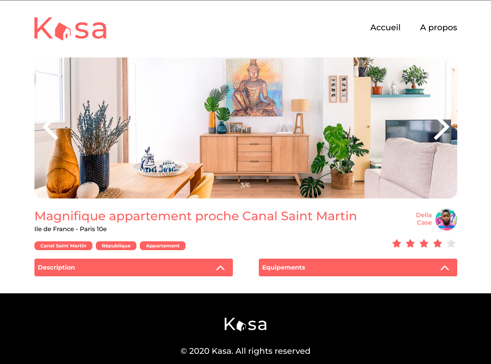

# Kasa project - React App - OC

Kasa App is the fifth project in the OpenClassrooms web developer program. It's an apartment rental application for private individuals.

Objectives: 
- Start the React project. 
- Develop the whole application, React components, React Router routes. 
- Follow the Figma mock-ups and information given. 
- `json` file to simulate the back-end.


## Preview




## Technologies Used

- React 18
- React Router 6
- SASS


## Project Structure

```
src/
  ├── assets/
  ├── components/
  ├── pages/
  ├── styles/
  ├── index.js
  └── Rout.js
```


## License

Distributed under the OpenClassrooms License.


## Developper

Lisa Sibeni - log@sibeni.li

Project Link: [https://github.com/sibeni-li/projet_5](https://github.com/sibeni-li/projet_5)